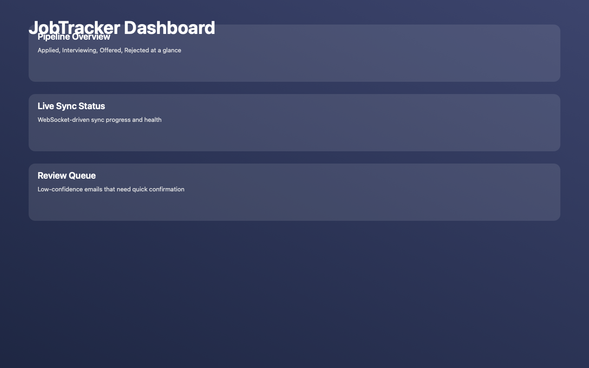
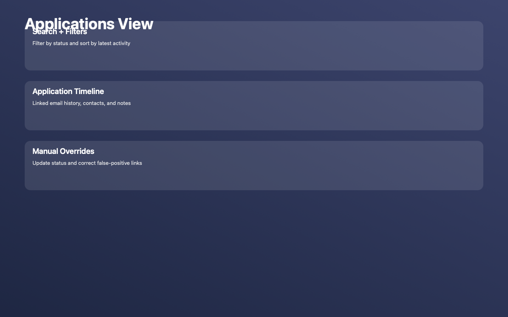
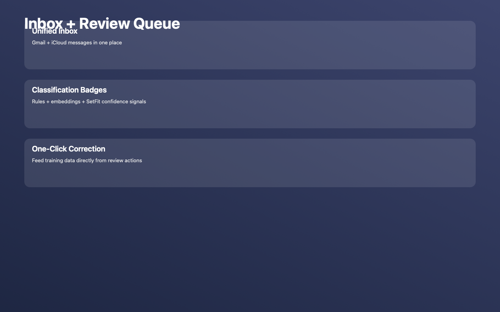

# JobTracker — Email-Powered Job Application Tracker

A native macOS application that automatically tracks your job applications by reading your Gmail and iCloud Mail, classifying emails using local ML, and presenting a beautiful Liquid Glass dashboard of your job search progress.

## Overview

JobTracker syncs your email from Gmail and iCloud, identifies job-related messages (rejections, interview requests, offers, confirmations), and organizes them into a trackable pipeline — so you never lose track of where you stand.

**Key principles:**
- 🔒 **Privacy-first**: All processing happens locally. Your emails never leave your machine.
- 💰 **Zero cost**: No API fees, no subscriptions. Uses free local ML models.
- 🍎 **Native macOS**: Built with SwiftUI and Liquid Glass design for macOS 15+.

## Screenshots

### Dashboard



### Applications



### Inbox + Review Queue



## Architecture

- **Backend**: Python 3.11+ (FastAPI, async) — handles email fetching, ML classification, and data management
- **Frontend**: SwiftUI with Liquid Glass — native macOS 15+ experience
- **Database**: SQLite (WAL mode, async via aiosqlite) — shared between backend and frontend
- **ML**: 3-layer hybrid classifier (rules → embeddings → SetFit)
- **Background Sync**: SMAppService + launchd (modern macOS approach)
- **Icons**: SF Symbols 7

```
┌─────────────────────────────────────────────────────────────────┐
│                        macOS 15+ (Sequoia/Tahoe)                │
│                                                                 │
│  ┌─────────────────────┐  REST API   ┌────────────────────────┐ │
│  │   SwiftUI App       │◄───────────►│   Python Backend       │ │
│  │   (Liquid Glass UI) │ :8000       │   (FastAPI + async)    │ │
│  │                     │             │                        │ │
│  │  ┌───────────────┐  │             │  ┌──────────────────┐  │ │
│  │  │ MenuBarExtra  │  │             │  │ Gmail + iCloud   │  │ │
│  │  │ Dashboard     │  │             │  │ Hybrid Classifier│  │ │
│  │  │ SF Symbols 7  │  │             │  │ Embeddings Store │  │ │
│  │  └───────────────┘  │             │  └──────────────────┘  │ │
│  │                     │             │                        │ │
│  │  GRDB.swift (read)  │             │  aiosqlite (write)     │ │
│  └──────────┬──────────┘             └───────────┬────────────┘ │
│             │                                    │              │
│             └──────────► SQLite (WAL) ◄──────────┘              │
│                    ~/Library/Application Support/               │
│                                                                 │
│             SMAppService → launchd (background sync)            │
└─────────────────────────────────────────────────────────────────┘
```

## Key Features

- [x] Gmail OAuth2 integration (read-only)
- [x] iCloud Mail IMAP integration (async via aioimaplib)
- [x] ML email classification (3-layer hybrid: rules → embeddings → SetFit)
- [x] Application pipeline dashboard (Applied → Interview → Offer → Rejected)
- [x] Scheduled background email sync (via SMAppService + launchd)
- [ ] Analytics module (currently de-scoped from active app surface)
- [x] Confidence-based review (uncertain classifications flagged for user)
- [x] User correction feedback loop (improves ML over time)
- [x] Menu bar status icon (MenuBarExtra)
- [x] Liquid Glass UI + SF Symbols 7 (native macOS Tahoe design)
- [ ] Smart reminders (follow-up suggestions)
- [ ] Spotlight integration (search applications from Spotlight)
- [ ] Browser extension (capture applications from job sites)

## Documentation

| Document | Description |
|----------|-------------|
| [Architecture](docs/ARCHITECTURE.md) | System design, technology choices, and component interactions |
| [Phases](docs/PHASES.md) | Implementation phases with trackable checkboxes |
| [ML Strategy](docs/ML_STRATEGY.md) | Email classification approach, models, and training strategy |
| [API Specification](docs/API_SPEC.md) | Python backend REST API endpoints |
| [Setup Guide](docs/SETUP.md) | Development environment setup instructions |
| [Repo Structure](docs/REPO_STRUCTURE.md) | Monorepo layout, commit boundaries, and CI behavior |

## Tech Stack

| Component | Technology |
|-----------|------------|
| Backend API | Python 3.11+, FastAPI (async), Uvicorn |
| Database (Backend) | SQLite + aiosqlite + SQLModel (async ORM) |
| Gmail Integration | google-api-python-client (OAuth2) |
| iCloud Integration | aioimaplib (async IMAP) |
| ML Classification | sentence-transformers (e5-small-v2), SetFit, scikit-learn |
| Embeddings Storage | SQLite (not pickle files) |
| macOS Frontend | SwiftUI (macOS 15+), Liquid Glass, SF Symbols 7 |
| Database (Frontend) | GRDB.swift + GRDBQuery (reactive reads) |
| Charts | Swift Charts (built-in) |
| Background Service | SMAppService + launchd |
| Credential Storage | macOS Keychain via `keyring` |
| Distribution | PyInstaller (backend bundling), notarized DMG |

## System Requirements

| Requirement | Minimum | Recommended |
|-------------|---------|-------------|
| macOS | 15.0 (Sequoia) | 26.0 (Tahoe) |
| RAM | 8GB | 16GB |
| Disk Space | 5GB free | 10GB free |
| CPU | Any Apple Silicon or Intel | M1 or later |
| GPU | Not required | Not required |

> **Note:** 8GB RAM works fine for normal operation. SetFit retraining (2-5 min, occasional) uses ~2GB peak RAM. A "lite mode" disables SetFit for constrained machines.

## Project Structure (Current)

```
jobtracker/
├── backend/
│   ├── jobtracker/                 # FastAPI app, classifier, DB models
│   ├── tests/                      # Backend test suite
│   ├── requirements*.txt
│   └── pyproject.toml
├── apps/
│   ├── macos/
│   │   └── JobTracker/JobTracker/  # Xcode project + SwiftUI app
│   └── mobile/
│       └── README.md               # Placeholder for future iOS/Android app
├── docs/
│   ├── ARCHITECTURE.md
│   ├── PHASES.md
│   ├── ML_STRATEGY.md
│   ├── API_SPEC.md
│   ├── REPO_STRUCTURE.md
│   └── SETUP.md
├── .github/workflows/              # CI checks (backend + macOS)
├── scripts/
│   ├── install.sh                  # Backend setup
│   ├── start_backend.sh            # Local backend launcher
│   ├── bundle.sh                   # Build app bundle + embedded backend
│   ├── notarize.sh                 # Notarize signed app
│   └── repair_local_db.sh          # SQLite corruption recovery
└── dist/                           # Distribution artifacts (gitignored)
    └── ...
```

## CI

- `backend-ci.yml`: Runs backend tests (`pytest`) on pull requests and pushes that touch backend-related paths.
- `macos-ci.yml`: Runs `xcodebuild` for the macOS app on pull requests and pushes that touch macOS app paths.
- Both workflows are read-only quality gates (no auto-format commits, no source mutation).

## Quick Start

```bash
# Clone
git clone https://github.com/YOUR_USERNAME/jobtracker.git
cd jobtracker

# Backend setup
./scripts/install.sh

# Start backend
./scripts/start_backend.sh

# Or, from backend/:
./backend/start.sh

# See docs/SETUP.md for full setup including Gmail/iCloud auth
```

For active backend development with hot reload, use:

```bash
./scripts/start_backend.sh --reload
```

## Troubleshooting

If backend responses include `database disk image is malformed`, run:

```bash
./scripts/repair_local_db.sh
```

By default this repairs:

- `~/Library/Application Support/JobTracker/jobtracker.db`
- and creates a timestamped backup under `~/Library/Application Support/JobTracker/backups`

If you see `Address already in use` for port `8000`, check if backend is already running:

```bash
curl http://127.0.0.1:8000/health
```

If needed, stop conflicting listeners:

```bash
lsof -nP -iTCP:8000 -sTCP:LISTEN
kill <PID>
```

## Packaging (macOS)

Build a staged app bundle with an embedded PyInstaller backend binary:

```bash
./scripts/bundle.sh --configuration Debug
```

Artifacts are written to:

- `dist/backend/jobtracker-backend`
- `dist/app/JobTracker.app`

For universal app builds (Intel + Apple Silicon), the bundle script builds the macOS app for
`arm64` and `x86_64` by default.

ML model strategy is currently **download on first launch** to keep app size smaller.
The embedding model is cached locally after first use.

After code signing, notarize and staple:

```bash
./scripts/notarize.sh dist/app/JobTracker.app
```

## License

MIT
